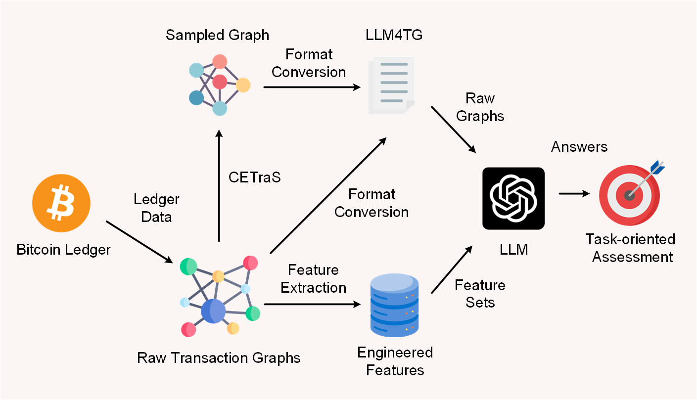
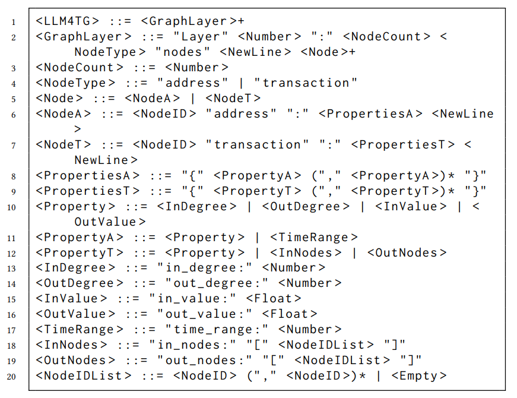

# LLM4TG

This project includes the source code for our work **[Large Language Models for Cryptocurrency Transaction Analysis: A Bitcoin Case Study](https://arxiv.org/abs/2501.18158)**. If you find our work helpful for your research, please consider citing it as:

    @article{lei2025large,
      title={Large Language Models for Cryptocurrency Transaction Analysis: A Bitcoin Case Study},
      author={Lei, Yuchen and Xiang, Yuexin and Wang, Qin and Dowsley, Rafael and Yuen, Tsz Hon and Yu, Jiangshan},
      journal={arXiv preprint arXiv:2501.18158},
      year={2025}
    }

If you have any questions please feel free to contact by e-mail at Yuexin.Xiang@monash.edu.

## Contents

- [Dataset](#dataset)
- [Layered Assessment Framework](#layered-assessment-framework)
- [LLM4TG Format](#llm4tg-format)
- [CETraS](#cetras-algorithm)
- [Additional Notes](#additional-notes)
- [Acknowledgment](#acknowledgment)

## Dataset 
### 1. Bitcoin Address Subgraph Dataset ([BASD-8](https://www.kaggle.com/datasets/lemonx/basd8))  
BASD-8 serves as our primary dataset for experiments. It captures *transactional subgraph structures* of Bitcoin addresses and was introduced in our [**IEEE Big Data'22** paper](https://ieeexplore.ieee.org/abstract/document/10020980).

### 2. Bitcoin Address Behavior Dataset ([BABD-13](https://www.kaggle.com/datasets/lemonx/babd13))  
BABD-13 is used to explore the differences between *raw graph structures* and *graph-derived features*. The subset of this dataset used in this work (i.e., `babd13-slim.csv`) contains the same addresses as BASD-8 but focuses on *behavioral patterns* derived from Bitcoin transactions. It was introduced in our [**IEEE TIFS'24** paper](https://ieeexplore.ieee.org/abstract/document/10375557).

## Layered Assessment Framework

We propose a **three-level framework** for measuring the understanding of a transaction graph. The following illustration and descriptions provide an overview of the proposed framework and its levels:

  

---

### **Level 1 - Foundational Metrics**  
LLMs can determine the **basic information** of the graph (see `lv1_nodebasic`), such as:  
- **In-degree** of a node  
- **Output token amount** of a node  

---

### **Level 2 - Characteristic Overview**  
LLMs can identify **key characteristics** of the graph (see `lv2_characteristic`), for example:  
- A node with a **significantly large out-degree**  
- A node that transfers a **significantly large total amount of tokens**

---

### **Level 3 - Contextual Interpretation**  
LLMs can classify **cryptocurrency address types** for **unlabeled addresses** by leveraging labeled address samples (see `lv3_categorize`).  

---

## LLM4TG Format

We denote T as transaction and A as address. <NodeID> represents the node’s ID, <Number> represents an integer. <Float> represents a real number. The **LLM4TG** syntax is displayed as follows:

  

The dataset in the LLM4TG format for subgraphs is also available in the [BASD-8](https://www.kaggle.com/datasets/lemonx/basd8).

## CETraS Algorithm
(purpose and which file) This algorithm compressed the ... subgraphs 

## Additional Notes
(how to reproduce the results shown in Tables and Figures from levels 1 - 3) First, our experiments on BASD-8 cover transaction graph understanding levels 1 to 3, details can be found in `2-basd8-basic.py`, where `aux_querygpt` function is used for querying through OpenAI APIs.

## Acknowledgment
This research is supported by **OpenAI Researcher Access Program**.

